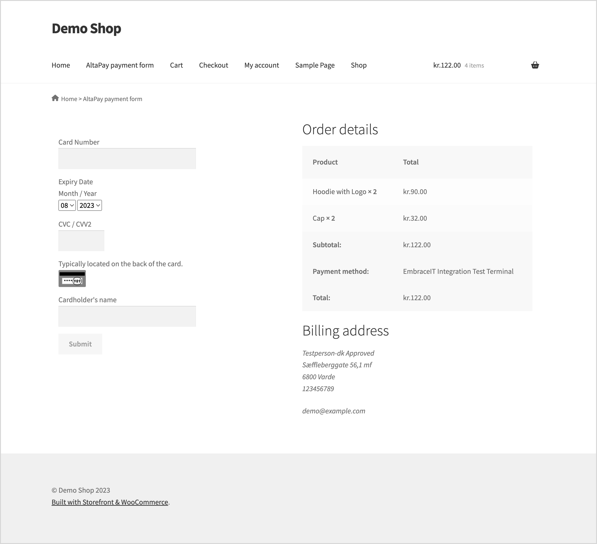
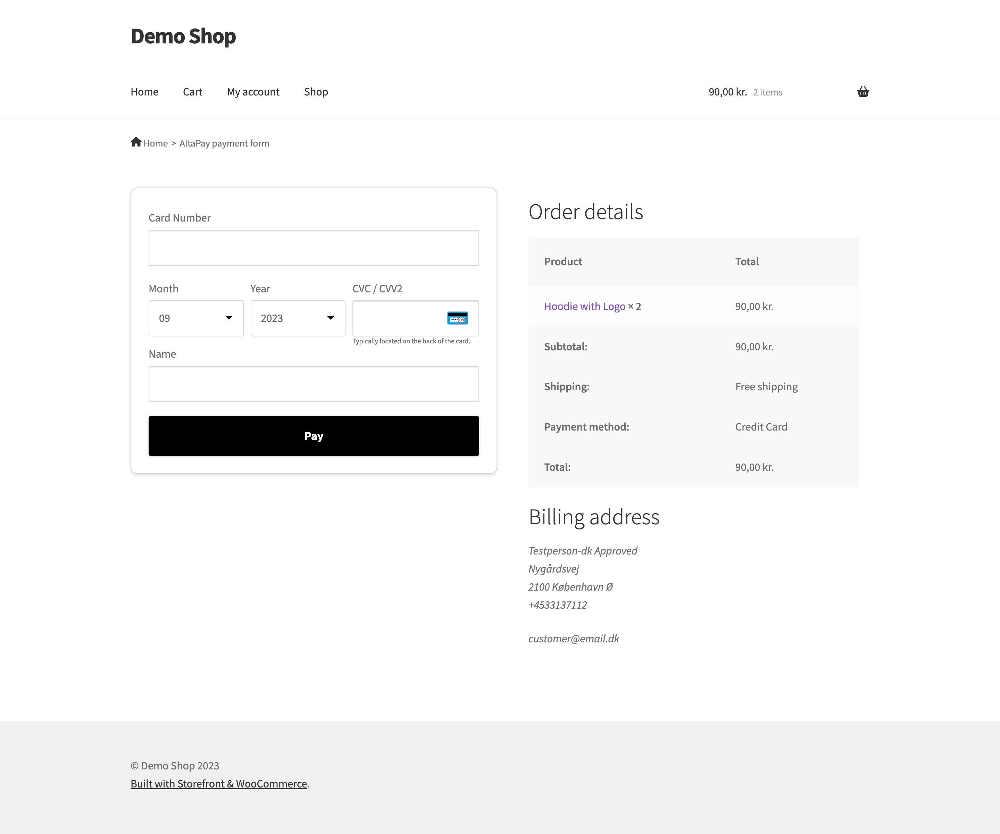
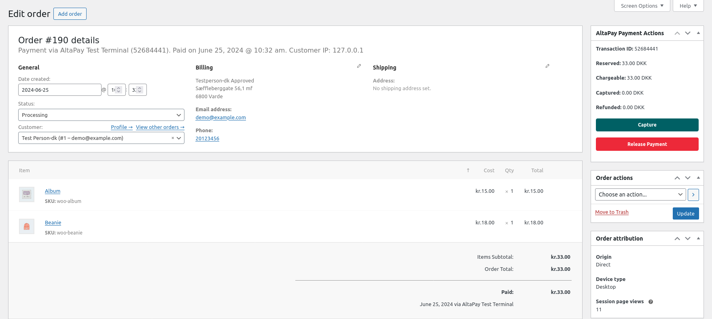
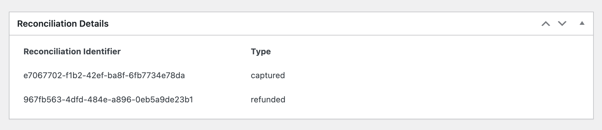

# AltaPay WooCommerce Plugin

AltaPay, headquartered in Denmark, is an internationally focused fintech company within payments with the mission to make payments less complicated. We help our merchants grow and expand their business across payment channels by offering a fully integrated seamless omni-channel experience for online, mobile and instore payments, creating transparency and reducing the need for manual tasks with one centralized payment platform.

AltaPay’s platform automizes, simplifies, and protects the transaction flow for shop owners and global retail and e-commerce companies, supporting and integrating smoothly into the major ERP systems. AltaPay performs as a Payment Service Provider operating under The Payment Card Industry Data Security Standard (PCI DSS).

WooCommerce is an open-source eCommerce platform, built on WordPress. You can modify and customize it to meet your (merchant's) needs, and works alongside other plugins.

## Installation Guide

Installing this plug-in will enable the web shop to handle card transactions through AltaPay's gateway.

**Table of Contents**

[Prerequisites](#prerequisites)

[Installation](#installation)

[Configuration](#configuration)

* [Gateway Account Configuration](#gateway-account-configuration)

* [Credit Card form styling](#credit-card-form-styling)

* [Configure fraud detection](#configure-fraud-detection)

* [Synchronize payment methods](#synchronize-payment-methods)

* [Configure the terminals for the checkout page](#configure-the-terminals-for-the-checkout-page)

* [Customize the checkout page](#customize-the-checkout-page)

[Capture Payment](#capture-payment)

[Refund Payment](#refund-payment)

[Subscriptions](#subscriptions)

[Reconcile Orders](#reconcile-orders)

[Update the plug-in](#update-the-plug-in)

[Supported versions](#supported-versions)

[Troubleshooting](#troubleshooting)

## Prerequisites

We highly recommend gathering all the below information before starting the installation:

- AltaPay credentials for the payment gateway, terminals and custom gateway (i.e. yourShopName.altapaysecure.com). These will be provided by AltaPay.

## Installation

There are two ways of installing the plug-in: by uploading the build package or by search for the plug-in [AltaPay for WooCommerce](https://wordpress.org/plugins/altapay-for-woocommerce/) on WordPress.org.

AltaPay WooCommerce plug-in needs to be installed on the merchant WooCommerce/WordPress website

There are two ways to install the plugin:

### By searching for the plug-in on WordPress.org: (Recommended)
- Navigate to Plugins > Add new.
- In the search text box (Search plugins…) type in the keyword "altapay"
- Wait for the plug-in to be found
- Once the plug-in has been set to be installed, you should see a message saying "Plugin installed successfully".
- Click on the Activate Plugin button.
- The message "Plugin activated" is displayed.

### By uploading the build package:
- From the admin panel, navigate to: Plugins > Add new
- Select Upload Plugin;
- Select the build package (zip file) that contains the plugin
- Click on Install Now.

## Configuration

You can configure the plugin to meet your (the merchant's) needs, adding payment methods and configuring payments.

The standard configuration connects the plugin with the test gateway. Take the following steps to connect it with your custom payment gateway.

### Gateway Account Configuration

To connect to the payment gateway:

- Navigate to: **WooCommerce > AltaPay Settings**

    

- Complete the Gateway URL, Username and Password fields with the information provided by AltaPay
- Click on **Create Page** button **_(mandatory)_**
- Click on **Save changes** button (in the bottom of the page).

This will populate all the available terminals for the current API user.
If you face any issue click on **Refresh connection** button, this will fetch the terminals again and populate the list.

### Credit Card form styling

Choose one of the below options from `Credit Card form style` dropdown to change the styling of Credit Card form on the checkout page.

- `Legacy` Choose this option if legacy form is enabled from the gateway side.
  
    
  
- `Checkout` Select the option to show the Credit Card form in a modern look. Make sure the checkout form is enabled from the gateway side.
  

    
  
- `Custom` This option can be selected to implement custom styling on the payment page. Selecting this option will remove all the styling from the payment page.

>  Follow [Customize the checkout page](#customize-the-checkout-page) section for more information on payment page styling.

### Configure fraud detection

If you wish to enable fraud detection service and release/refund if fraud is detected then refer to the below screenshot.
 

### Synchronize payment methods

1. **Using "Synchronize payment methods" button**

    To synchronize the terminals with the gateway, click on the **Synchronize payment methods** button. This will fetch the latest terminals from the gateway and will automatically configure based on the store country.

    

2. **Using script file** 

    Follow these steps to load and save the terminal configurations from the gateway.
    * Move the file from [terminal-config/altapay_config.php](https://github.com/AltaPay/plugin-wordpress/blob/main/terminal-config/altapay_config.php) to the root directory of the WordPress installation
    * Edit the file and replace `~gatewayusername~`,`~gatewaypass~`, and `~gatewayurl~` with the actual credentials.
    * Run the file with the below command

        $ php altapay_config.php

To select the Terminals:

- Select the payment terminals which should be shown on the checkout page by checking the checkbox related to each one.
- Click on the **Save changes** button.

### Configure the terminals for the checkout page

For the AltaPay payment method to appear in the checkout page:

- Navigate to WooCommerce > Settings
- Click on the **Payments** tab.

    

- For each AltaPay payment terminal, there must be a payment method. Refresh the page if you do not see any.
- Click on the desired payment terminal.

    

  - Complete the details, using the notes below for guidance.

      | Field                        | Description                                                                                                                                           |
      |------------------------------|-------------------------------------------------------------------------------------------------------------------------------------------------------|
      | Enable/Disable               | Enable or Disable the payment terminal.                                                                                                               |
      | Title                        | This field will appear in the checkout page as the title of the payment terminal.                                                                     |
      | Description                  | This field must contain the message that will appear for the customer in the checkout page and describes the payment terminal.                        |
      | Payment action               | Make payment authorized or authorized and captured.                                                                                                   |
      | Icon                         | Select image icon to display on checkout page.                                                                                                        |
      | Secret                       | Add the payment method secret as defined in the AltaPay payment gateway to enable checksum validation. To disable checksum validation leave it empty. |
      | Is Apple Pay?                | Check if the terminal is for Apple Pay payments.                                                                                                      |
      | Apple Pay form label         | This controls the label shown on Apple Pay popup window.                                                                                              |
      | Apple Pay Supported Networks | The payment networks the merchant supports.                                                                                                           |
      | Token Control                | Enable Customer Token Control.                                                                                                                        |
- Save the changes.

### Customize the checkout page

The checkout page is implemented by the following file:

`<wordpress>/wp-content/plugins/altapay-for-woocommerce/views/altapay-payment-form.php`

To customize this page, copy the file to the root director `yourtheme/altapay-payment-form.php` of your active theme. The file inside the theme folder will override the file inside the plugin folder.

CSS code may be added to this file. Check the documentation about customizing the checkout page in [Styling the payment page (callback_form).](https://documentation.altapay.com/Content/Ecom/Payment%20Pages/Styling%20the%20payment%20page%20(callback_form).htm)

> Note:
>
> HOWEVER, on occasion AltaPay will need to update this file and you
> (the theme developer) will need to copy the new file to your theme to
> maintain compatibility. 

## Capture Payment

To capture the order follow the below steps:

* Navigate to **WooCommerce** > **Orders**
* Open an order that you want to capture
* Scroll to **AltaPay actions** section
* Select the **Capture** tab (selected by default)
* Change the quantities of the items for a partial capture
* Click on **Capture** button

   

## Refund Payment

To refund the order follow the below steps:

* Navigate to **WooCommerce** > **Orders**
* Open an order that you want to refund
* Scroll to **AltaPay actions** section
* Select **Refund** tab
* Change the quantities of the items for a partial refund
* Click on **Refund** button

   

> Note:
>
> When the status of an order is manually changed to 'Completed', the plug-in will automatically try > to capture this order – there is no need for any setup for this.
> 
> If the order was already fully or partially captured, no capture will be made.

## Subscriptions

AltaPay plugin is compatible with the [WooCommerce Subscriptions](https://woocommerce.com/products/woocommerce-subscriptions/) extension to accept recurring payments in your WooCommerce store.

> Note:
>
> Currently, AltaPay plugin supports recurring payments with the credit card  and vipps terminal only.

## Reconcile Orders
In order to reconcile payments please follow the steps below:

1. From the admin panel, navigate to: **WooCommerce > Orders**
2. Select the order you want to view.
3. Copy the Reconciliation Identifier from the **Reconciliation Details** section.

   

    Or export the reconciliation data to CSV using the `Export Reconciliation Data` button on the top of `Orders` page.

   
   

4. Navigate to AltaPay Gateway dashboard
5. Click on **FUNDING FILES** under **FINANCES** menu
6. Download the CSV file
7. Or you can find the payment in the transaction list, open the reconciliation file from there and download a csv file
8. Open the downloaded CSV file and match the **Reconciliation Identifier** with WordPress's **Reconciliation Identifier**.

**Sample AltaPay Gateway CSV:**

 

## Update the plug-in

- Navigate to: Plugins > Installed Plugins
- If there is a new version of the plug-in, you should see a warning message, as is shown in the image below.

    

- Click on the **update now** link.

> Warning:
>
> If you customized the plugin source code, the changes may be overwritten in the update process.

## Supported versions

Minimum system requirements are:
- WordPress min. 5.0 – max. 6.2.2
- WooCommerce min. 3.9.0 – max. 7.9.0
- PHP 7.3 and above
- PHP-bcmath library installed.
- PHP-curl MUST be enabled.

The latest tested version is:
- WordPress 6.2.2, WooCommerce 7.9.0 and PHP 8.1

## Troubleshooting

### PHP Warning: Input variables exceeded 1000
For orders that contain many products, this PHP warning may be issued. In the file "php.ini" there is a setting called "max_input_vars" that need to have the limit increased (i.e. from 1000 to 3000). Once the changes are made a restart to the web server is required.

### Description/UnitPrice/Quantity is required for each orderline, but it was not set for line: xxxx
The same problem as above: the request has been truncated because the number of variables are exceeding the max_input_vars limit.

### Order failed: Could not create the payment request
For the case when checkout fails with error "Could not create the payment request" in most cases the issue is that Shipping Options were not set to "Force shipping to the customer billing address" and the detailed error in the Order notes will be "customer_info[shipping_country] was not a valid country".

The setting is located is in: WooCommerce > Settings > Shipping > Shipping Options:

### Providing error logs to support team

**You can find the CMS logs by following the below steps:**

From Admin Dashboard navigate to **"WooCommerce > Status > Logs"** tab

**Web server error logs**

**For Apache server** You can find it on **/var/log/apache2/error.log**

**For Nginx** it would be **/var/log/nginx/error.log**

**_Note: Your path may vary from the mentioned above._**
