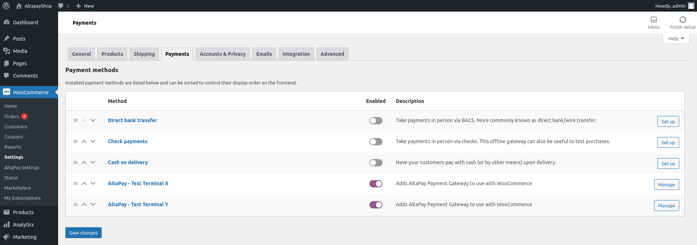

# AltaPay WooCommerce Plugin

AltaPay, headquartered in Denmark, is an internationally focused fintech company within payments with the mission to make payments less complicated. We help our merchants grow and expand their business across payment channels by offering a fully integrated seamless omni-channel experience for online, mobile and instore payments, creating transparency and reducing the need for manual tasks with one centralized payment platform.

AltaPay’s platform automizes, simplifies, and protects the transaction flow for shop owners and global retail and e-commerce companies, supporting and integrating smoothly into the major ERP systems. AltaPay performs as a Payment Service Provider operating under The Payment Card Industry Data Security Standard (PCI DSS).

WooCommerce is an open-source eCommerce platform, built on WordPress. You can modify and customize it to meet your (merchant's) needs, and works alongside other plugins.

# WooCommerce Payment plugin installation guide

Installing this plug-in will enable the web shop to handle card transactions through AltaPay's gateway.

**Table of Contents**

[Prerequisites](#prerequisites)

[Installation](#installation)

[Configuration](#configuration)

[Supported versions](#supported-versions)

[Troubleshooting](#troubleshooting)

# Prerequisites

We highly recommend gathering all the below information before starting the installation:

- AltaPay credentials for the payment gateway, terminals and custom gateway (i.e. yourShopName.altapaysecure.com). These will be provided by AltaPay.

# Installation

There are two ways of installing the plug-in: by uploading the build package or by search for the plug-in [Altapay for WooCommerce](https://wordpress.org/plugins/altapay-for-woocommerce/) on WordPress.org.

AltaPay WooCommerce plug-in needs to be installed on the merchant WooCommerce/WordPress website

There are two ways to install the plugin:

## By uploading the build package:
- From the admin panel, navigate to: Plugins > Add new
- Select Upload Plugin;
- Select the build package (zip file) that contains the plugin
- Click on Install Now.

## By searching for the plug-in on WordPress.org:
- Navigate to Plugins > Add new.
- In the search text box (Search plugins…) type in the keyword "altapay"
- Wait for the plug-in to be found
- Once the plug-in has been set to be installed, you should see a message saying "Plugin installed successfully".
- Click on the Activate Plugin button.
- The message "Plugin activated" is displayed.

# Configuration

You can configure the plugin to meet your (the merchant's) needs, adding payment methods and configuring payments.

The standard configuration connects the plugin with the test gateway. Take the following steps to connect it with your custom payment gateway.

## Connect the plugin to the custom payment gateway

To connect to the payment gateway:

- Navigate to: **WooCommerce > AltaPay Settings**

- Complete the Gateway URL, Username and Password fields with the information provided by AltaPay
- Click on **Create Page** button **_(mandatory)_**
- Click on **Save changes** button (in the bottom of the page).

To select the Terminals:

- Click on **Synchronize payment methods** button, where a list with one or more payment terminals will be shown.
- Select the payment terminals which should be shown on the checkout page by checking the checkbox related to each one.
- Click on the **Save changes** button.

## Configure the terminals for the checkout page

For the AltaPay payment method to appear in the checkout page:

- Navigate to WooCommerce > Settings
- Click on the **Payments** tab.

- For each AltaPay payment terminal, there must be a payment method. Refresh the page if you do not see any.
- Click on the desired payment terminal.

- Enable the payment terminal.
- Complete the text field "Title"; this field will appear in the checkout page as the title of the payment terminal.
- Complete the field "Message"; this field must contain the message that will appear for the customer in the checkout page and describes the payment terminal.
- Check if the selected currency matches WooCommerce currency. (WooCommerce currency can be viewed in WooCommerce > Settings > General tab)
- Save the changes.

## Update the plug-in

- Navigate to: Plugins > Installed Plugins
- If there is a new version of the plug-in, you should see a warning message, as is shown in the image below.

- Click on the "update now" link.

> Warning:
>
> If you customized the plugin source code, the changes may be overwritten in the update process.

## Customize the checkout page

The checkout page is implemented by the following file:

`<wordpress>/wp-content/plugins/altapay-for-woocommerce/views/altapay-payment-form.php`

To customize this page, copy the file to the folder of the theme that WordPress is currently using. The file inside the theme folder will override the file inside the plugin folder.

CSS code may be added to this file. Check the documentation about customizing the checkout page in [Styling the payment page (callback_form).](https://documentation.altapay.com/Content/Ecom/Payment%20Pages/Styling%20the%20payment%20page%20(callback_form).htm)

## Auto-capture when order status changes to "Completed"

When the status of an order is manually changed to 'Completed', the plug-in will automatically try to capture this order – there is no need of any setup for this.

If the order was already fully or partially captured, no capture will be made.

# Supported versions

Minimum system requirements are:
- WordPress min. 5.0 – max. 5.8.2
- WooCommerce min. 3.9.0 – max. 5.9.0
- PHP 7.0+
- PHP-bcmath library installed.
- PHP-curl MUST be enabled.

The latest tested version is:
- WordPress 5.8.2, WooCommerce 5.9.0 and PHP 7.4

# Troubleshooting

### PHP Warning: Input variables exceeded 1000
For orders that contain many products, this PHP warning may be issued. In the file "php.ini" there is a setting called "max_input_vars" that need to have the limit increased (i.e. from 1000 to 3000). Once the changes are made a restart to the web server is required.

### Description/UnitPrice/Quantity is required for each orderline, but it was not set for line: xxxx
The same problem as above: the request has been truncated because the number of variables are exceeding the max_input_vars limit.

### Order failed: Could not create the payment request
For the case when checkout fails with error "Could not create the payment request" in most cases the issue is that Shipping Options were not set to "Force shipping to the customer billing address" and the detailed error in the Order notes will be "customer_info[shipping_country] was not a valid country".

The setting is located is in: WooCommerce > Settings > Shipping > Shipping Options:

## Providing error logs to support team

**You can find the CMS logs by following the below steps:**

From Admin Dashboard navigate to **"WooCommerce > Status > Logs"** tab

**Web server error logs**

**For Apache server** You can find it on **/var/log/apache2/error.log**

**For Nginx** it would be **/var/log/nginx/error.log**

**_Note: Your path may vary from the mentioned above._**
